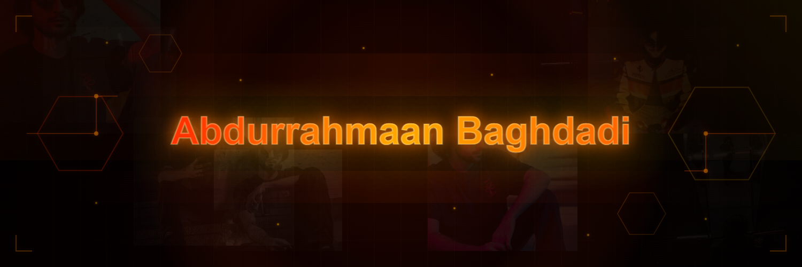

  

# ⚡ ABDURRAHMAAN BAGHDADI
### AI Researcher • Full-Stack Engineer • Security Practitioner

  
  
  

---

## 🛰️ MISSION OVERVIEW
M.S. Artificial Intelligence student at **UT Austin** with **5+ years of research experience** across IoT security, applied machine learning, and full-stack systems. Currently conducting multimodal AI research on pediatric brain tumor diagnosis. Built production systems that measurably cut equipment loss; placed competitively in industry-sponsored ML competitions.

---

## 🏆 FEATURED INTEL (Detailed Projects)

### 🔴 [Energy AI Hackathon — Mission Impossible](https://github.com/Abdurrahmaan-Baghdadi)
**Sole Programmer** on an interdisciplinary team competing against 40 teams (sponsored by Phillips66, Chevron, ExxonMobil).
* **Technical Specs:** Built ensemble stacking pipeline (HGB / GBR / ExtraTrees / Ridge).
* **Optimization:** Implemented GroupKFold cross-validation, physics-based imputation, and domain-engineered features (RQI, FZI).
* **Result:** Achieved **R² = 0.9849 out-of-fold**.
`Python` `Scikit-learn` `XGBoost` `Pandas` `NumPy`

### 🛡️ [IoT Lab Inventory & Digital Forensics](https://github.com/Abdurrahmaan-Baghdadi)
* **Lab Management:** Shipped RESTful API and DB abstraction layer for 50–100 devices; **reduced equipment loss by 25%**.
* **Forensics Platform:** Investigation of consumer IoT via firmware extraction (Autopsy/Emba), traffic capture (Wireshark), and artifact recovery (ELK Stack).
* **Compliance:** Led PostgreSQL-based firmware integrity project benchmarked against **NIST criteria**.
`React.js` `TypeScript` `Flask` `Elastic Stack` `Kali Linux`

### 🧠 [Deep Learning & Encryption Series](https://github.com/Abdurrahmaan-Baghdadi)
* **Computer Vision:** CNN classification, multi-task segmentation/detection, and Transformer-based trajectory prediction with full TensorBoard instrumentation.
* **Cryptography:** Developed "Easy-Encryption" (Java) using **AES-256-GCM** and **PBKDF2** with zero third-party dependencies.
`PyTorch` `Transformers` `CNNs` `Java` `AES-256`

---

## 🛠️ TECH STACK (System Capabilities)

| Layer | Technologies |
| :--- | :--- |
| **Artificial Intelligence** | `PyTorch` `Scikit-learn` `XGBoost` `HuggingFace Transformers` `Pandas` `NumPy` `Jupyter` `TensorBoard` |
| **Security & Infrastructure** | `Security+` `Wireshark` `Nmap` `ELK Stack` `ROCK NSM` `Autopsy` `Emba` `Kali Linux` `AWS EC2` |
| **Languages** | `Python` `TypeScript` `JavaScript` `SQL` `Java` `ANSI C` `Bash` `R` `PHP` `C#` |
| **Web & Databases** | `React.js` `Flask` `Node.js` `Express` `PostgreSQL` `MySQL` `MongoDB` `Nginx` |

---

## 🧪 CURRENT OPERATIONS
* **Multimodal Pathology AI:** Benchmarking vision-language models (**WSI-LLaVA, Quilt-LLaVA, Concept Bottleneck Models, WSI-VQA**) for pediatric brain tumor diagnosis at the **UT Austin Pediatric Brain Tumor AI Lab**.
* **Graduate Coursework:** Machine Learning (AI 391L), Deep Learning, and Analysis of Algorithms at UT Austin.

---

## 🎓 ACADEMIC PROTOCOLS
* **M.S. Artificial Intelligence** — University of Texas at Austin (Exp. 2027)
* **B.S. Computer Science (Cybersecurity Minor)** — UTSA (*Summa Cum Laude*, 3.93 GPA)
* **Certifications:** CompTIA Security+ • DeepLearning.AI ML/Math Specializations

---

## 🔗 CONNECT

